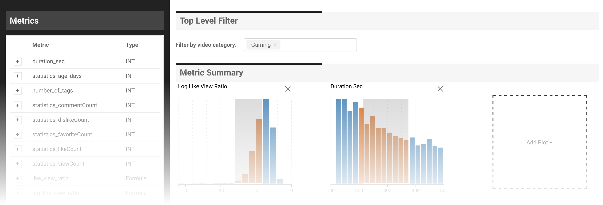

# Youtube Data Visualization

> A MIDS W209 Final Project
Fall 2016  

Yiran Sheng, Safyre Anderson, Alejandro Rojas


[Demo Link](https://yiransheng.github.io/youtube-viz/index.html)




## Overview

Abstract:
[YouTube](www.youtube.com) hosts 100 of millions of videos uploaded by people from all walks of life. Our project was interested in creating a dashboard that could help YouTube content providers find patterns in YouTube's most popular videos.  

Built with the following libraries:

- d3
- plottable.js
- React
- Redux

### Features

- Dynamic Reporting
- Configurable metrics and calculations
- Cross-filtering

Our dashboard encourages uses to start with an overview of provided metrics.  A user can click on an empty plot area and choose the metric they wish to build a histogram with. Below the histograms, a user can also view a line chart of video's uploaded over time. These plots are all connected to a drop-down filter for video categories; each metric will update for the selected category(ies). Other plots that go along with the time series plot are the time-of-day upload chart and the views per video duration scatter plot. Finally, a sorted barchart illustrates the top 5 channel idsof for a particular metric.  This could allow users to quickly find popular channels to follow or perhaps emulate. 

## Dataset

Initially, we had planned on using a sample from the [YouTube 8M dataset](https://research.google.com/youtube8m/). As the name suggests, the YT8M dataset consists of over 8 million youtube videos along with 4600 dimensionally reduced and transformed video-level and frame-level features. However, the features from this dataset were not human-readable--their intended use is for machine learning research projects.  We were able to extract about 18,000 youtube id's which we used in conjunction with the [YouTube Data API](https://developers.google.com/youtube/v3/) to collect more familiar features such as video category, like count, etc. 

Note: The YouTube API also provided links to thumbnail .jpegs, which we originally thought could be used to answer the question: "Are there particular color schemes that are correlated with video popularity?" In our midterm demo, we had created a simple interactive visualization that showed where certain thumbnails fell on a color wheel. However, our user-testing revealed this type of visualization was not quite intuitive and its utility was also questionable; we decided to abandon this part of the project altogether.

## Python Preprocessing

### Color parsing of thumbnails:
See [notebook](./data/YT-DominantColor.ipynb)

### Download of data:

Thanks to a script provided by a developer in the [YT8M google community](https://github.com/jmhessel/YT8M-ids/blob/master/download_ids.py), we were able to quickly retrieve the sample of video ids from the YT8M project to. These video id's were required to make API calls to the YouTube API /v3/videos endpoint. 

<pre>
/download-scripts/
├── api_driver.py
├── config
│   └── config.ini.template
├── data
│   ├── YT-DominantColor.ipynb
│   ├── __init__.py
│   ├── get_ids_from_labels.py
│   ├── train-labels-histogram.csv
│   ├── training_ids.txt.gz
│   ├── yt8m_sample.csv.gz
│   └── yt_output_sample.json
└── utils
    ├── DataIngestor.py
    ├── DataSampleGenerator.py
    ├── __init__.py
</pre>

## Installation

Once installed dependencies (`nodejs`, `npm`), the app can be run as: 

```bash
cd app
npm install
npm start
```

### Install

Requires `node` verion >=5.0.0 `npm` version >= 3.0.0. Older versions of them work fine mostly, but it's recommanded to upgrade.

Install node on mac:
```
brew install node
```

```
node -v
npm -version
```


For fresh install grab `node` here:

```
https://nodejs.org/en/
```

For upgrading `node` and `npm`, refer to this resource: [http://tecadmin.net/upgrade-nodejs-via-npm/](http://tecadmin.net/upgrade-nodejs-via-npm/). Short summary:

```
# check node version
node -v
# clean npm cache
sudo npm cache clean -f
# install upgrade util n
sudo npm install --global n
# upgrade node and npm
sudo n stable
```

Once `node` and `npm` are up-to-date, run the following to install dependencies:

```
npm install
```


### Update Dependencies

Only `npm` is used to manage dependencies, run (under the folder `yt8m`):

```
npm update
```
